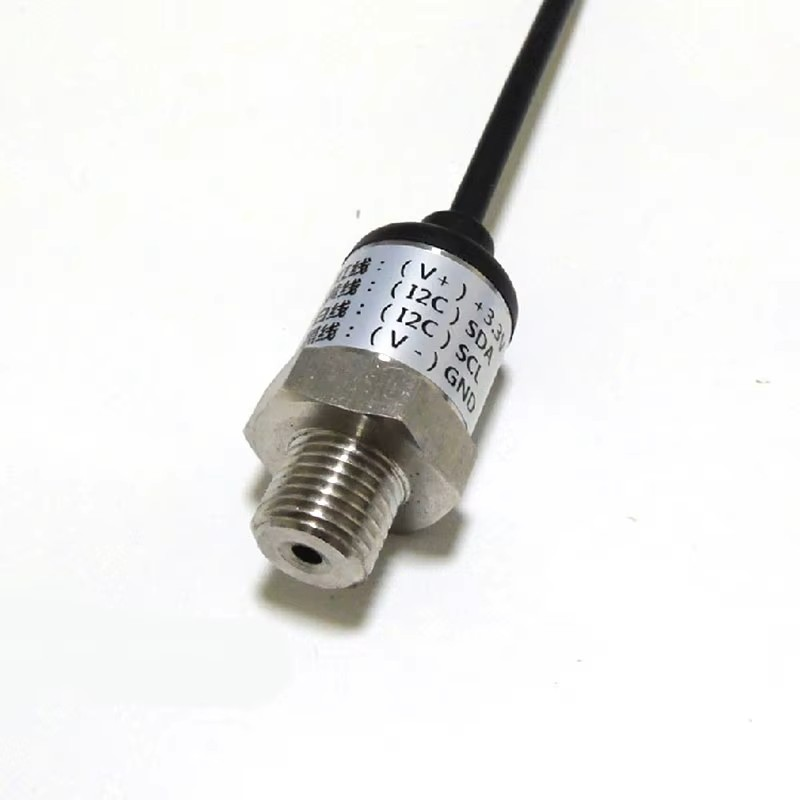

# esp-matter-devices

A collection of Matter devices i've built using [esp-matter](https://github.com/espressif/esp-matter/) SDK for **esp32** family SoCs.

Important: these are quick cheap and dirty 'working enough' implementations built on top of SDK samples, so consider them more like a source of useful insights, than ready to use polished products.

### Contents:

### [lunalamp-matter](/lunalamp-matter/)

Extended Color Light device for RGBWW strips, port of my HomeKit [lunalamp-esp32](https://github.com/thisiseth/lunalamp-esp32/). 
Transforms Matter XY/CT colors into RGBWW and uses LEDC PWM with external MOSFETs to drive a 12v led strip.

### [matter-water-pressure-sensor](/matter-water-pressure-sensor/)

Makes a Matter pressure and temperature sensor from an aliexpress water pressure sensor known as KY-3V3-IIC or KY-3V3-I2C, this one:

Although the sensor indeed does report temperature, i would not rely heavily on it - i guess there are reasons it is not advertised as a pressure AND temperature sensor

### [doorbell-chime](/doorbell-chime)

A Matter 1.5-introduced chime device using ESP32 8-bit DAC or I2S PCM-to-PDM to output a small wave file. Crude and requires trickery to use with Home Assistant.

DAC is available only on ESP32, PCM-to-PDM is available virtually everywhere.

DAC can be used if you have a way to amplify the analog signal (e.g. a TDA IC), or you can try using PCM-to-PDM with a small gate charge MOSFET like AO3400.

## How to

### Prerequisites

If using Windows, the most troublesome part is setting up the **esp-matter** SDK itself — since **esp-matter** is basically an abstraction over the [CHIP](https://github.com/project-chip/connectedhomeip/) SDK, 
native Windows build is not supported.

WSL2 is fine, but you have to store **esp-matter** inside the native linux fs — Windows to linux fs passthrough won't work.

### Provisioning

If you want your device to have a non-generic vendor, name and a unique provision QR-code — 
follow the instructions here https://github.com/espressif/esp-matter-tools/tree/main/mfg_tool
